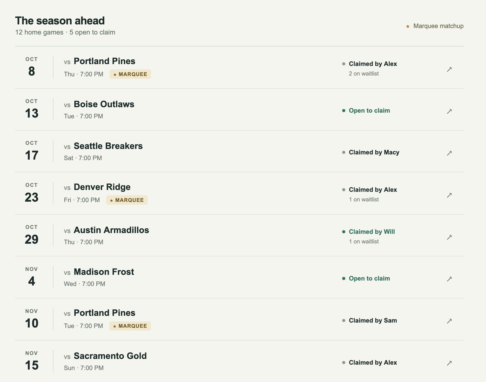
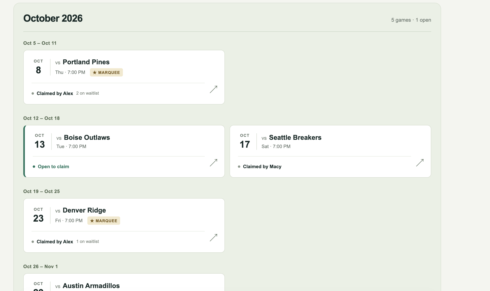

# Project Brief: Season Ticket Split Coordinator

Live link: https://macyesk.github.io/three-screens/#overview
 
Repository Link: https://github.com/macyesk/three-screens.git

**Need:** Friends splitting an NHL season ticket package don't know which games each other actually cares about until it's too late. Sometimes someone assumes no one wants a game and skips it, only to find a friend really wanted it, or two people show up expecting the same seat. Without a running record, it's easy for one person to end up with way more (or fewer) games — especially the big ones — than everyone else, without anyone noticing until the season's mostly over.

**Persona:** Part of a group of 3-5 friends splitting one NHL season ticket package. Has favorite opponents/rivalry games they care more about. Checks in on the group sporadically, not constantly.

**Capability:** Claim a specific game (first to claim wins), see who else wants which games, join a waitlist if a game is already claimed, and see each person's game count — including marquee/rivalry games — so the group can spot overlaps, gaps, and imbalances before it's too late.

**Fundamental Value: FAIRNESS.** Everyone can see, at a glance, that the split is even (including the good games, not just the total count) and that their preferences were accounted for — instead of trusting memory or hoping it evens out.

## The Three Screens

### 1. Season Overview (Landing screen)

**Job:** Signal the core value (fairness) and primary capability (see and claim games) before the user reads anything else.
**Why:** This gives the user an overall signal of the basic functionality of the app before having to proceed any further into the app.
**Design question it answers:** Does the landing screen communicate capability and value at first glance, with nothing competing for attention?

### 2. Game Detail

**Job:** Demonstrate the core interaction, claiming a game and the waitlist mechanic.
**Why:** This screen allows the user to understand the ownership of the game and what they are still able to do with it. This demonstrates the main functionality of the app which is people being able to claim games.
**Design question it answers:** Is the primary capability obvious and satisfying to use? Does the layout group "game info," "who has it," and "what I can do" clearly (Gestalt: proximity)?

### 3. Fairness Summary

**Job:** Make the fairness value tangible and visible with real numbers, not just implied by the app's existence.
**Why:** This reinforces the main value of the app. Users can identify uneven distribution of games easily. It shows that people have successfully claimed games.
**Design question it answers:** Does the grouping/alignment of the data make an unequal split obvious at a glance, without needing labels explained?

| Question | Predicted Answer |
| -------- | -------- |
| Need: What do you use to facilitate sharing season tickets and what is annoying about it?   | We are using a groupchat, but sometimes people claiming games would get buried. One time we tried to make a calendar but it was hard to tell who had which game.   Prototype: Easily see who has claimed a game on the landing page.     |
| Persona: How often are you checking for claimed games, what are you usually doing when you check?   | I check probably weekly when I am planning out my weeknights.  Prototype: Grouping games by week helps see what the status of that week’s games are.   |
| Value: What would you need a new solution to do for you to convert to it?    | It would need to make it easy to see how many games each person has been to.  Prototype: Fairness tracker shows how many games each person has claimed and how many marquee games they have claimed.     |
| Capability: Click around on this and tell me what you think it is for.   | I think it is a tool to organize attendance at games. It also tracks how many games each person has gone to against the others.  Prototype: Horizontal bar charts show group members claim numbers against each other. Cards list each game and who it is claimed by. Game detail pages say the game belongs to someone.     |

## Design Justification

- Does the landing screen signal the primary capability and fundamental value at first glance, before reading? 
Yes. The first thing you see if the split of games for each person and you can see a little bit of the area where you can see claimed games.
- Does every element on the landing screen earn its place, or does anything compete with the primary job? 
Everything on the landing screen has its place. The main capability and value are represented equally and solely.
- What information and actions belong together on each screen, and which Gestalt grouping principle communicates that? 
Closure is used frequently on most of the pages. Boxes represent each area well.

These images show on top the original product and on the bottom the new product. The change demonstrate the proximity principle grouping games by week. The lack of visual distinction makes it difficult to see what is happening. Improving white space and changing the utilization of both closure and proximity.
- Do screens 2 and 3 stay on mission, and can you return to the landing screen from everywhere? 
Yes they are directly connected to the main purpose of the app and the return to the landing screen is clear.
- What did the AI initially get wrong, skip, or oversimplify, and what did you change? 
The AI initially made the landing page a little bit more unclear than I desired. The claim calendar all at the same level was confusing. Breaking it out into different proximity groups help minimize the mental load required to make a decision about the next step.
- Which design question or grouping/signaling decision motivated each important change?
I wanted less proximity among all of the game claims. I thought it made sense to spread things out to utilize proximity to bring clarity to that section.

